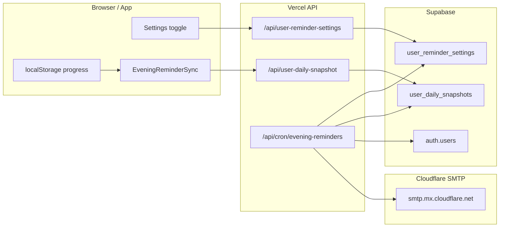

# Evening Email Reminders

LexiLand can email signed-in users at **8:00 PM local time** when they have not finished today's learning tasks. Reminders are **opt-in** (off by default).

## User experience

1. User signs in with Supabase (email must be on the account).
2. User opens **Settings** → **Evening learning reminders** → enables the toggle.
3. While signed in, the app syncs today's progress to the cloud in the background.
4. At 8 PM in the user's device timezone, the server checks whether tasks are incomplete.
5. If incomplete, LexiLand sends one reminder email for that calendar day.

Users can turn reminders off anytime in Settings. The email footer also mentions this.

**Guests** (not signed in) cannot receive reminders — there is no email address and no cloud snapshot.

## What counts as "incomplete"

The cron job reads the latest **daily snapshot** for the user's local date (`YYYY-MM-DD`). A reminder is sent when **any** of these is true:

| Condition | Meaning |
| --- | --- |
| No snapshot for today | User has not opened the app while signed in today (generic reminder) |
| `all_daily_tasks_done = false` | One or more daily tasks remain |
| `streak_safe_today = false` | No meaningful learning activity recorded today (streak at risk) |

### Daily tasks (from `src/lib/learningActivity.js`)

| Task ID | Target |
| --- | --- |
| `reviewWords` | Review 5 words |
| `playGame` | Play 1 learning game |
| `clearMistakes` | Clear 3 mistakes |

Incomplete task IDs are stored in `pending_task_labels` and listed in the email.

### Streak safety (from rewards engine)

`streak_safe_today` mirrors `hasCompletedLearningToday` in the rewards store — the user performed at least one meaningful learning action today (review, quiz, game, etc.).

## Architecture



### Data flow

1. **Opt-in** — `PATCH /api/user-reminder-settings` upserts `user_reminder_settings` (timezone, locale, enabled flag).
2. **Sync** — `EveningReminderSync` debounces (~4s) and `POST /api/user-daily-snapshot` upserts today's row in `user_daily_snapshots`.
3. **Cron** — Vercel hits `/api/cron/evening-reminders` every hour. For each enabled user whose local hour is **20**, the job loads the snapshot, decides if a reminder is needed, sends email, and sets `last_reminder_sent_date`.

Progress still lives in **localStorage** on the client. The snapshot is a server-side copy used only for the nightly email — not a full cloud sync of rewards state.

## Database

Migration: `supabase/migrations/20260705_evening_reminders.sql`  
Also appended to `supabase/schema.sql`.

### `user_reminder_settings`

| Column | Type | Notes |
| --- | --- | --- |
| `user_id` | uuid PK | FK → `auth.users` |
| `evening_reminder_enabled` | boolean | Default `false` |
| `timezone` | text | IANA timezone, default `Asia/Hong_Kong` |
| `locale` | text | Email language hint, default `zh-HK` |
| `last_reminder_sent_date` | date | Prevents more than one email per local day |

### `user_daily_snapshots`

| Column | Type | Notes |
| --- | --- | --- |
| `user_id`, `date_key` | composite PK | `date_key` = `YYYY-MM-DD` in user timezone |
| `streak` | integer | Current streak count |
| `daily_tasks_completed` / `daily_tasks_total` | integer | Progress summary |
| `all_daily_tasks_done` | boolean | All 3 daily tasks done |
| `streak_safe_today` | boolean | Learning activity recorded today |
| `pending_task_labels` | jsonb | e.g. `["reviewWords","playGame"]` |
| `missions_completed` / `missions_total` | integer | Stored for future use; not used in send logic yet |

Both tables use RLS: users can read/write only their own rows. The cron job uses the **service role** key to read all opted-in users.

## API routes

| Route | Method | Auth | Purpose |
| --- | --- | --- | --- |
| `/api/user-reminder-settings` | GET | Bearer (signed-in user) | Load settings |
| `/api/user-reminder-settings` | PATCH | Bearer | Save opt-in, timezone, locale |
| `/api/user-daily-snapshot` | POST | Bearer | Upsert today's snapshot |
| `/api/cron/evening-reminders` | GET, POST | `Authorization: Bearer CRON_SECRET` | Run reminder job |

### Snapshot POST body (client → server)

```json
{
  "dateKey": "2026-07-05",
  "timezone": "Asia/Hong_Kong",
  "locale": "zh-HK",
  "streak": 3,
  "hasCompletedLearningToday": false,
  "dailyTasksCompleted": 1,
  "dailyTasksTotal": 3,
  "allDailyTasksDone": false,
  "missionsCompleted": 2,
  "missionsTotal": 6,
  "streakSafeToday": false,
  "pendingTaskLabels": ["reviewWords", "playGame"]
}
```

### Cron response (example)

```json
{
  "ok": true,
  "sent": 2,
  "skipped": 15,
  "candidates": 2,
  "checked": 17,
  "errors": []
}
```

## Source files

| Area | Path |
| --- | --- |
| Migration | `supabase/migrations/20260705_evening_reminders.sql` |
| Cron handler | `server/api/handlers/cron-evening-reminders.js` |
| Settings API | `server/api/handlers/user-reminder-settings.js` |
| Snapshot API | `server/api/handlers/user-daily-snapshot.js` |
| Job logic | `server/lib/eveningReminderJob.js` |
| Email templates | `server/lib/eveningReminderContent.js` |
| SMTP sender | `server/lib/sendEmail.js` |
| Snapshot builder | `src/features/reminders/buildReminderSnapshot.js` |
| Client API | `src/features/reminders/reminderApi.js` |
| Background sync | `src/features/reminders/EveningReminderSync.jsx` |
| Settings UI | `src/features/reminders/EveningReminderSettings.jsx` |
| Cron schedule | `vercel.json` — **disabled** (see Deployment checklist to enable) |

Router entries: `cron/evening-reminders`, `user-reminder-settings`, `user-daily-snapshot` in `server/api/router.js`.

## Environment variables

Add to `.env.local` (local API) and **Vercel → Settings → Environment Variables**:

| Variable | Required | Purpose |
| --- | --- | --- |
| `CLOUDFLARE_API_TOKEN` | Yes | Cloudflare Email Sending API token (SMTP password) |
| `SMTP_SENDER_EMAIL` | Yes | e.g. `no-reply@lexiland.cc` (domain must be onboarded in Cloudflare) |
| `SMTP_SENDER_NAME` | No | Display name, default `力思樂園` |
| `SUPABASE_SERVICE_ROLE_KEY` | Yes | Cron reads all users + sends via admin client |
| `SUPABASE_URL` / `VITE_SUPABASE_URL` | Yes | Supabase project URL |
| `CRON_SECRET` | Yes (production) | Vercel sends `Authorization: Bearer <CRON_SECRET>` on cron invocations |
| `SITE_URL` / `VITE_APP_URL` | No | Link in email body, default `https://learn.lexiland.cc` |

SMTP uses the same Cloudflare setup as Supabase auth email (`npm run configure:supabase-smtp`). See `.env.example`.

## Deployment checklist

> **Note:** The Vercel cron is **disabled** in `vercel.json` until you are ready to send reminders. The API route and Settings UI still ship with the app; only the scheduled hourly trigger is off.

1. **Run the migration** in Supabase SQL Editor:
   ```bash
   # Paste contents of:
   supabase/migrations/20260705_evening_reminders.sql
   ```

2. **Set env vars on Vercel** (see table above). Generate `CRON_SECRET` with a long random string.

3. **Enable the cron** — add this to the top level of `vercel.json` (JSON does not allow comments, so keep the block removed until you need it):
   ```json
   {
     "crons": [{
       "path": "/api/cron/evening-reminders",
       "schedule": "0 * * * *"
     }]
   }
   ```
   Then redeploy.

4. **Verify SMTP** — same token/domain as login emails. If magic-link email works, reminders should too.

5. **Enable in app** — sign in, open Settings, turn on evening reminders.

## Testing

### Dry-run cron (no emails sent)

```bash
curl -s -H "Authorization: Bearer YOUR_CRON_SECRET" \
  "https://learn.lexiland.cc/api/cron/evening-reminders?dryRun=1"
```

Counts candidates that would receive mail without sending.

### Local API

1. Start dev server: `npm run dev`
2. Sign in in the browser
3. Enable reminders in Settings
4. Complete partial tasks (e.g. review 2 words, skip games)
5. Inspect Supabase table `user_daily_snapshots` for today's row

Local cron calls require `CRON_SECRET` in `.env.local` unless `NODE_ENV !== production` (dev allows missing secret).

### Force a send (advanced)

Temporarily set `EVENING_REMINDER_HOUR` in `server/lib/eveningReminderJob.js` to the current local hour, or wait until 8 PM. Ensure `last_reminder_sent_date` is not today for your test user:

```sql
update public.user_reminder_settings
set last_reminder_sent_date = null
where user_id = 'YOUR_USER_UUID';
```

## Email content

Built in `server/lib/eveningReminderContent.js`:

- **Subject (zh):** 力思樂園：今晚還有學習任務未完成 🌙
- **Subject (en):** LexiLand: You still have learning tasks tonight 🌙
- Body includes progress, streak message, unfinished task list, CTA button to `SITE_URL`
- Locale follows `user_reminder_settings.locale` (`zh-*` → Traditional Chinese, else English)

## Operational notes

- **One email per local day** — `last_reminder_sent_date` is updated after a successful send.
- **Hourly cron, 8 PM send window** — Cron runs every hour UTC; only users at local hour `20` are processed. Supports multiple timezones without per-region cron entries.
- **Invalid timezone** — Falls back to `Asia/Hong_Kong`.
- **No snapshot** — User gets a generic reminder (still useful if they never opened the app).
- **Completed everything** — No email even if reminders are enabled.
- **Vercel Cron** — Requires a Vercel plan that supports cron jobs (Hobby includes limited cron).

## Troubleshooting

| Symptom | Likely cause |
| --- | --- |
| Toggle saves but no emails | Cron not deployed, `CRON_SECRET` mismatch, or not 8 PM local yet |
| Cron returns 401 | Wrong or missing `CRON_SECRET` |
| Cron returns `Email is not configured` | `CLOUDFLARE_API_TOKEN` missing on Vercel |
| Settings load/save fails | Migration not applied; tables missing |
| Snapshot never updates | User not signed in, or API auth error (check browser console) |
| Email bounces / not delivered | Cloudflare domain not onboarded for sending; check sender address |

## Future improvements (not implemented)

- Per-user preferred reminder hour
- Unsubscribe link with signed token (currently: Settings toggle only)
- Push notifications (Capacitor) as an alternative channel
- Server-side inference from `review_events` when client snapshot is stale
